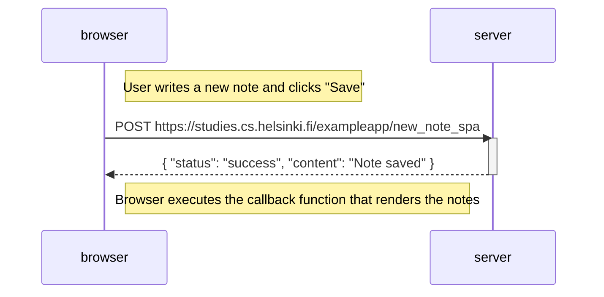

```mermaid
sequenceDiagram
    participant browser
    participant server

    Note right of browser: User writes a new note and clicks "Save"

    browser->>server: POST https://studies.cs.helsinki.fi/exampleapp/new_note_spa
    activate server
    server-->>browser: { "status": "success", "content": "Note saved" }
    deactivate server

    Note right of browser: Browser executes the callback function that renders the notes
```
